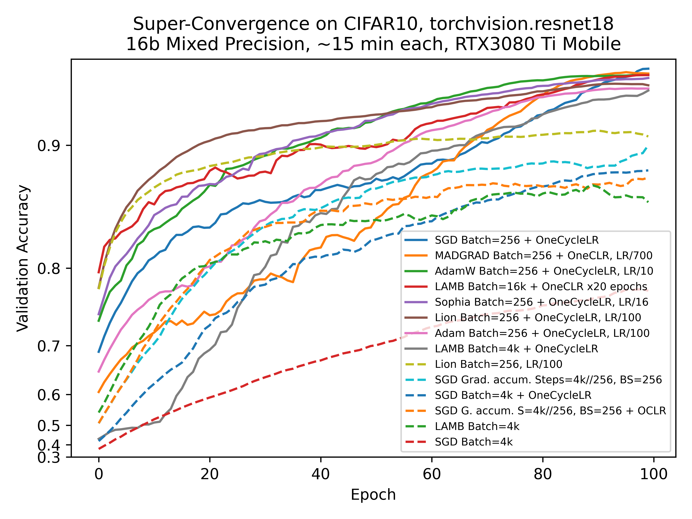
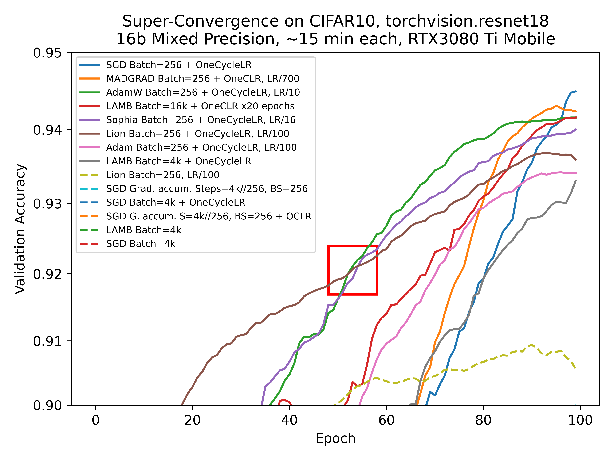
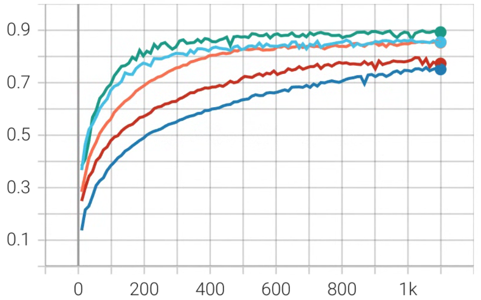
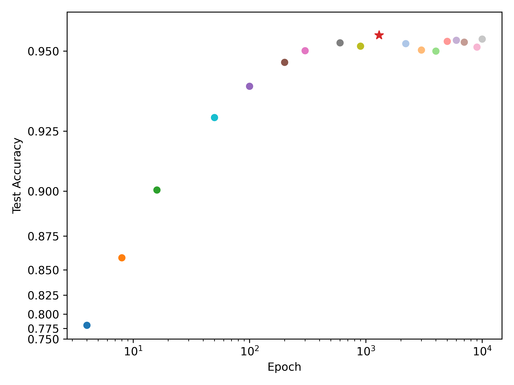
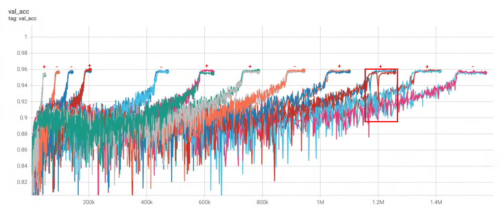
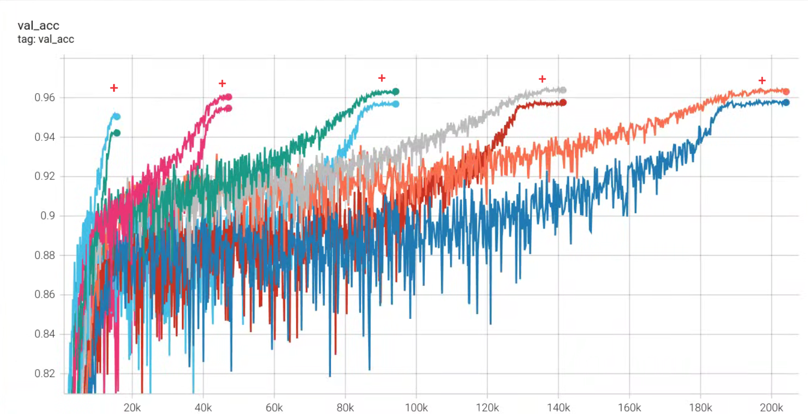
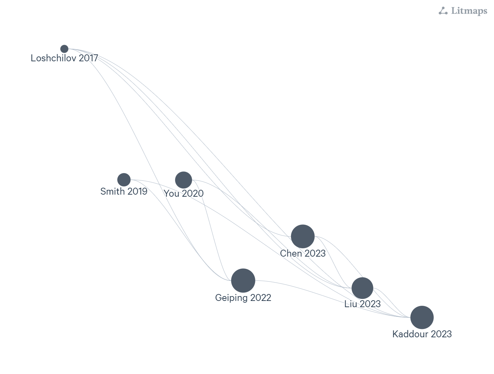

📈 Free 5% Accuracy Boost with Super-Convergence: Revisited

Insights:
1. SGD is still the best (blue plot)
2. LAMB sucks (trains 100 years to performance of AdamW) (red plot)
3. AdamW is the best among stable optimizers (2nd image, red box)
4. Gradient accumulation sucks (X mini-batch SGD x Y Gradient accumulation != XY batch LAMB,  Super-Convergence is not noticeable, more GA charts of various optimizers to justify the point are on the 3rd image)
5. The One Cycle Scheduler saturates after some number of epoch (4th image)
6. Stochastic Weight Averaging does not improve the validation accuracy significantly: +0.0678%, std: 0.143%, though sometimes stabilizes training (5th image, red box) 
7. Schedule-free optimizers are mid and not schedule-free as advertised
8. Sharpness-Aware Minimization consistently gives +0.684%, std: 0.0869% (6th image)

References (7th image):
* 2017 Loshchilov, Decoupled Weight Decay Regularization (AdamW)
* 2019 Smith, Super-convergence: very fast training of neural networks using large learning rates
* 2020 You, Large Batch Optimization for Deep Learning: Training BERT in 76 minutes
* 2020 Foret, Sharpness-Aware Minimization for Efficiently Improving Generalization
* 2022 Geiping, Cramming: Training a Language Model on a Single GPU in One Day
* 2023 Chen, Symbolic Discovery of Optimization Algorithms
* 2023 Liu, Sophia: A Scalable Stochastic Second-order Optimizer for Language Model Pre-training
* 2023 Kaddour,	No Train No Gain: Revisiting Efficient Training Algorithms For Transformer-based Language Models
* 2024 Defazio, The Road Less Scheduled
* 2024 Hägele, Scaling Laws and Compute-Optimal Training Beyond Fixed Training Durations

